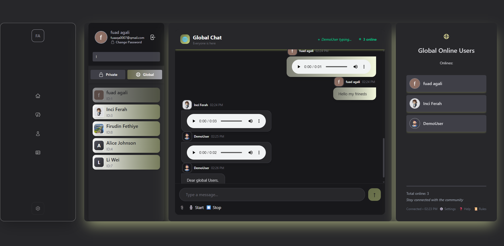
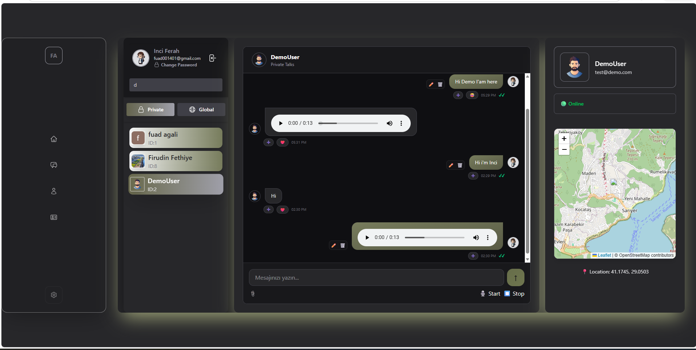

# me_web_chat

# Chat Web Application

Live Demo: [https://me-web-chat.vercel.app](https://me-web-chat.vercel.app)

## Screenshots

### Global Chat

### Private Chat

## Features

- **[User Registration](ca://s?q=Explain_user_registration_with_email)** with real email validation
- **[JWT Authentication](ca://s?q=Explain_JWT_authentication)** with refresh tokens
- **[SMTP Email Verification](ca://s?q=Explain_SMTP_email_verification)** for account confirmation
- **[Cookie-based Sessions](ca://s?q=Explain_cookie_based_sessions)** for secure persistence
- **[Cloudinary Integration](ca://s?q=Explain_Cloudinary_file_uploads)** for photo and voice file storage
- **[Google OAuth Login](ca://s?q=Explain_Google_OAuth_login)** with avatar sync from Gmail
- **[Database-as-a-Service Neon](ca://s?q=Explain_Neon_Database_as_a_Service)** for production PostgreSQL
- **[Backend Hosting](ca://s?q=Explain_Render_backend_hosting)** on Render
- **[Frontend Hosting](ca://s?q=Explain_Vercel_frontend_hosting)** on Vercel
- **[Password Reset](ca://s?q=Explain_password_reset_flow)** and **Forgot Password** with reset token invalidation
- **[Socket.io Typing Indicators](ca://s?q=Explain_Socket_typing_indicators)** and online user count
- **[Message Editing](ca://s?q=Explain_message_editing_feature)**, reactions with emojis, delete & read receipts
- **[Voice Messaging](ca://s?q=Explain_voice_message_feature)** with recorder and file input
- **[Geolocation Sharing](ca://s?q=Explain_geolocation_sharing_in_chat)** if user opts in
- **[Avatar Upload](ca://s?q=Explain_avatar_upload_feature)** via file input
- **[Database Tools](ca://s?q=Explain_pgAdmin_pg_dump_restore)**: pgAdmin, pg_dump, .sql restore to Neon
